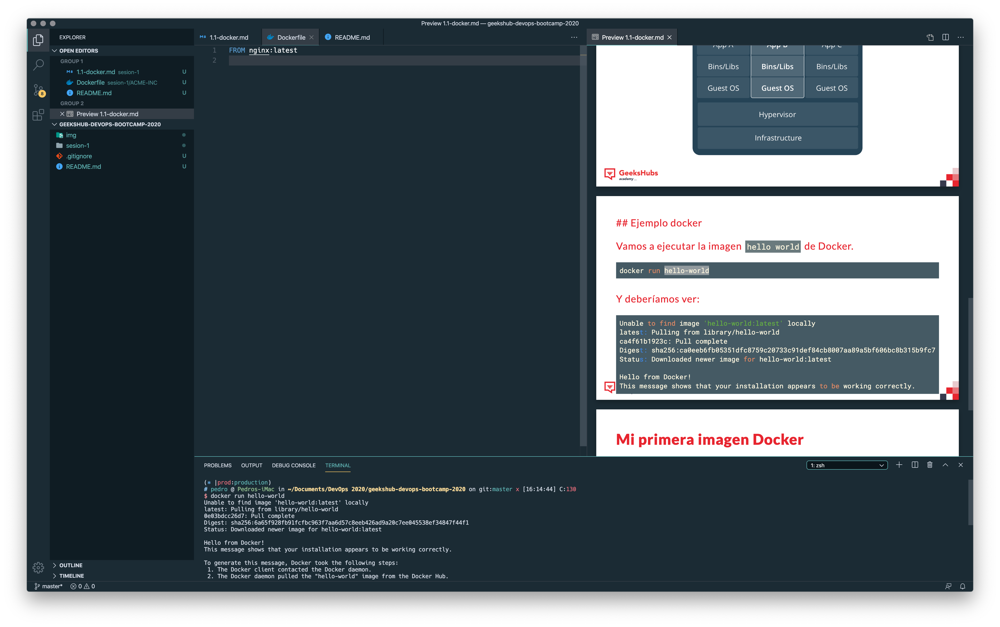

# Bloque 2.5 - Desplegando contenedores

```
Profesor: Pedro Díaz
```

## Agenda

- Sesión 1:
    - ¿Qué es Docker?
    - Dockerizando una aplicación.
    - Desplegando mi aplicación con contenedores - Primeros pasos.
    - ¿Cómo trabajamos en Mercadona Tech con contenedores?

- Sesión 2:
    - Estrategias de despliegue con contenedores.
    - Flujo de trabajo con contenedores.
    - ¿Cómo es el flujo de desarrollo en Mercadona Tech?

## Requerimientos

Principalmente vamos a usar `docker`. Si tu sistema operativo es Linux o macOS no tendrás grandes problemas ya que funciona *algo* mejor que en Windows.

Para instalarlo podemos seguir las guías oficiales:

- Windows: https://docs.docker.com/docker-for-windows/
- macOS: https://docs.docker.com/docker-for-mac/install/
- Linux (ubuntu): https://docs.docker.com/engine/install/ubuntu/

Además es muy recomendable tener a mano un buen editor de código con el que nos sintamos cómodos. Personalmente recomiendo `vscode` de Microsoft. Es multiplataforma y tiene infinidad de plugins in configuraciones.

- vscode: https://code.visualstudio.com/

Hay ciertos plugins para vscode que nos pueden ayudar pero no son para nada obligatorios:

- Docker plugin: https://marketplace.visualstudio.com/items?itemName=ms-azuretools.vscode-docker
- YAML suppor: https://marketplace.visualstudio.com/items?itemName=redhat.vscode-yaml
- Gremlins tracker, plugin para ver código y carácteres que nos pueden dar problemas: https://marketplace.visualstudio.com/items?itemName=nhoizey.gremlins

# Material de clase

Todo el material del curso lo encontrareis en este repositorio. Las transparencias estan hechas con [Markdown](https://www.markdownguide.org/). Y usando el motor de renderizado de [Marp](https://marp.app/). Existe también plugin para vscode por lo que si quereis podeis ver las transparencias en la misma ventana que el código y la terminal.

Si teneis curiosidad por la sintaxis de Marp, la tenéis [aquí](https://marpit.marp.app/directives).

Si decidís usar vscode con el plugin de `marp` podeis llegar a ver todo el material en una sola ventana.



----
Geekhubs - DevOps Bootcamp 2020 - Pedro Díaz
